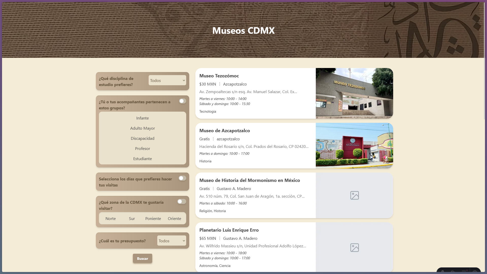

# Búsqueda de museos de la CDMX

Este proyecto tiene el objetivo de facilitar a las personas la búsqueda de museos en la CDMX a través de filtros específicos que puedan describir la disposición o preferencias del usuario.

La idea fue planteado para el proyecto de la materia de Sistemas expertos.

## 🧞 Commands

All commands are run from the root of the project, from a terminal:

| Command                   | Action                                           |
| :------------------------ | :----------------------------------------------- |
| `npm install`             | Installs dependencies                            |
| `npm run dev`             | Starts local dev server at `localhost:4321`      |
| `npm run build`           | Build your production site to `./dist/`          |
| `npm run preview`         | Preview your build locally, before deploying     |
| `npm run astro ...`       | Run CLI commands like `astro add`, `astro check` |
| `npm run astro -- --help` | Get help using the Astro CLI                     |

